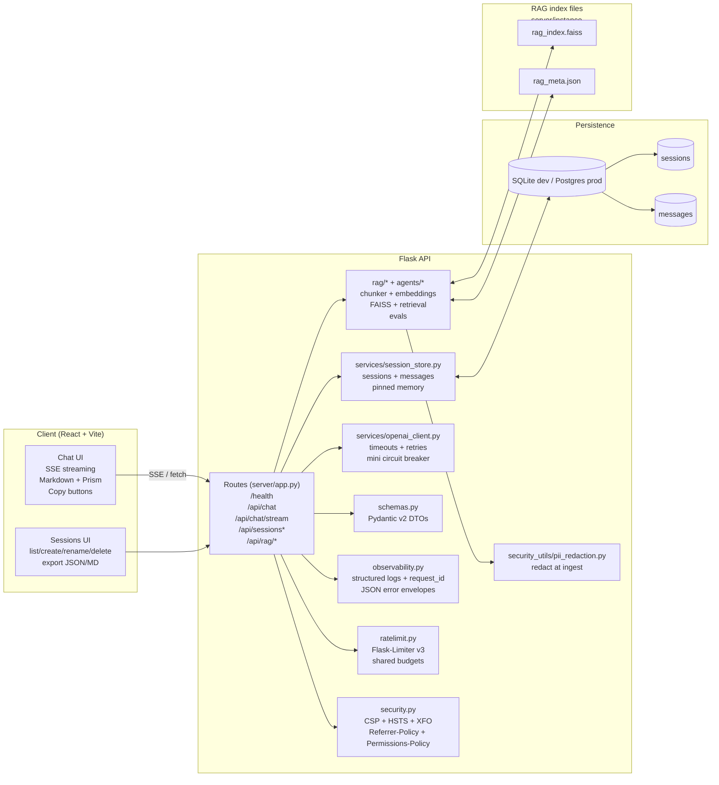

<!-- README.md -->

# Ask-Flask

A production-style LLM chat app with **React + Flask**, **SSE streaming**, **strict security headers**, **rate limiting**, **structured JSON logs**, and **server-backed Sessions** (create, rename, delete, export). Includes **session-pinned memory** and a **mini-RAG module** (FAISS + PII redaction + MMR + simple evals + micro-agent).


[](https://github.com/Jwmarsh16/ask-flask/actions/workflows/ci.yml)


---

## Live Demo

- Live: https://ask-flask.onrender.com/

---

## Table of contents

- [Architecture](#architecture)
- [Key features](#key-features)
- [Tech stack](#tech-stack)
- [Local quickstart](#local-quickstart)
- [Environment variables](#environment-variables)
- [Database & migrations](#database--migrations)
- [API reference](#api-reference)
- [Security](#security)
- [Observability](#observability)
- [Rate limiting](#rate-limiting)
- [Session memory](#session-memory)
- [RAG module](#rag-module)
- [Testing](#testing)
- [CI/CD](#cicd)
- [Render deployment](#render-deployment)
- [Troubleshooting](#troubleshooting)
- [Roadmap snapshot](#roadmap-snapshot)
- [License](#license)

---

## Architecture



**Principles:** small composable layers; typed DTOs; unified JSON error envelopes; SSE for realtime UX; security headers and rate limits on by default; observability everywhere.

---

## Key features

* **Streaming chat (SSE)** with graceful fallback to non-streaming.
* **GFM Markdown** + PrismJS (prism-tomorrow) + copy buttons (“Copied!” UX).
* **Sessions (server-backed):** list, create, delete, rename, export as JSON or Markdown.
* **Short-term context:** backend includes the most recent N exchanges (`CHAT_CONTEXT_MAX_TURNS`).
* **Pinned session memory:** compact summary stored on `Session.memory`, injected as a second system message, updated after each successful reply.
* **Mini-RAG:** ingest → chunk → PII redact → embed → FAISS index; optional MMR retrieval; citation-ready hits; tiny evals (Recall@k, p95 latency) and a simple agent.
* **Security by default:** CSP, HSTS, XFO, nosniff, referrer-policy, permissions-policy.
* **Reliability:** request IDs, structured logs, retries with jitter, and a minimal circuit breaker.
* **Abuse controls:** 4000-char cap per message; shared rate limit across chat endpoints.

---

## Tech stack

**Frontend**

* React (Vite, ESM, JavaScript)
* `react-markdown` + `remark-gfm`
* PrismJS (Tomorrow theme)
* Plain CSS (no Tailwind)
* Vitest + jsdom tests

**Backend**

* Python 3.11.9, Flask
* OpenAI Python SDK 1.x wrapped by `OpenAIService` (timeouts, retries, mini breaker)
* SQLAlchemy + Alembic (Flask-Migrate)
* Pydantic v2 DTOs
* Flask-Limiter v3 (shared budgets)
* Structured JSON logs + request IDs
* SSE streaming via `stream_with_context`

**Databases**

* Dev: SQLite (`server/instance/app.db`)
* Prod: Postgres (Render)

**RAG add-on**

* `faiss-cpu`, `numpy`
* Embeddings:

  * OpenAI embeddings when `OPENAI_API_KEY` is set (default: `text-embedding-3-small`)
  * `sentence-transformers` fallback (`all-MiniLM-L6-v2`) when no key is present

---

## Local quickstart

> Assumes Python 3.11.9 and Node 20.x.

```bash
# 1) Python environment
python -m venv .venv
source .venv/bin/activate
pip install -r requirements.txt -r requirements-dev.txt

# 2) Frontend deps
npm ci --prefix client

# 3) Local env (SQLite DB lives in server/instance/app.db)
cat > .env <<'EOF'
DATABASE_URI="sqlite:///$PWD/server/instance/app.db"
OPENAI_API_KEY="sk-REPLACE_ME"
FLASK_SECRET_KEY="dev"
FRONTEND_ORIGIN="http://localhost:5173"

CHAT_CONTEXT_MAX_TURNS=12
CHAT_MEMORY_ENABLED=true
CHAT_MEMORY_MAX_CHARS=2000
# CHAT_MEMORY_MODEL=gpt-3.5-turbo
EOF

# load env into current shell
set -a; . ./.env; set +a

# 4) Migrate DB
flask --app server.app:app db upgrade -d server/migrations

# 5) Run backend (port 5555)
flask --app server.app:app run -p 5555 --debug

# 6) Run frontend (port 5173; proxies /api → 5555)
npm run dev --prefix client
```

Open: [http://localhost:5173](http://localhost:5173)

---

## Environment variables

| Name                     | Purpose                              | Example                                                 |
| ------------------------ | ------------------------------------ | ------------------------------------------------------- |
| `OPENAI_API_KEY`         | OpenAI access key (chat requires it) | `sk-...`                                                |
| `FLASK_SECRET_KEY`       | Flask secret/session signing key     | long random string                                      |
| `DATABASE_URI`           | SQLAlchemy DB URL                    | `sqlite:///$PWD/server/instance/app.db` or Postgres URL |
| `FRONTEND_ORIGIN`        | Dev CORS allowlist                   | `http://localhost:5173`                                 |
| `CHAT_CONTEXT_MAX_TURNS` | Prior exchanges to include from DB   | `12` (set `0` to disable prior turns)                   |
| `CHAT_MEMORY_ENABLED`    | Toggle pinned memory                 | `true`                                                  |
| `CHAT_MEMORY_MAX_CHARS`  | Cap pinned memory length             | `2000`                                                  |
| `CHAT_MEMORY_MODEL`      | Model used for memory summarization  | `gpt-3.5-turbo`                                         |

Tip: Prefer absolute SQLite paths locally (as shown) so migrations and app runs always target the same DB.

---

## Database & migrations

```bash
set -a; . ./.env; set +a

flask --app server.app:app db upgrade -d server/migrations
flask --app server.app:app db current -d server/migrations
echo "$DATABASE_URI"
```

---

## API reference

### Health

```text
GET /health → 200
```

### Chat (non-stream)

```text
POST /api/chat
Body: { "message": string<=4000, "model"?: string, "session_id"?: string }
200:  { "reply": "..." }
Errors:
- 400 validation (Pydantic)
- 413 too large (message > 4000 chars)
- 429 rate limited (JSON error)
- 503 circuit open (JSON error)
- 5xx unified JSON error envelope
```

### Chat (SSE stream)

```text
POST /api/chat/stream    Content-Type: application/json
Response: text/event-stream

Frames:
data: {"request_id":"..."}            # kickoff frame
data: {"token":"..."}                 # repeated
data: {"done":true}                   # terminal

Error (still 200 response):
data: {"error":"...", "code":503|500, "request_id":"...", "done":true}
```

### Sessions

```text
GET    /api/sessions
POST   /api/sessions                  Body: { "title"?: string }
GET    /api/sessions/:id
PATCH  /api/sessions/:id              Body: { "title": string }  # trimmed + clamped in DTO
DELETE /api/sessions/:id
GET    /api/sessions/:id/export?format=json|md  # attachment
```

### RAG module

```text
POST /api/rag/ingest
Body: { "docs":[{id, department, text}, ...], "overwrite": false }
200:  { ok, ingested, emb_model }

POST /api/rag/query
Body: { "question"|"query":"...", "top_k"|"k":4, "department"?:string, "mmr_lambda"?:number }
200:  { ok, query, hits:[{score, doc_id, chunk_id, department, text}, ...] }

POST /api/rag/eval
Body: { "queries":[{"q":"...","expected_doc_id":"..."}], "k":4 }
200:  { ok, metrics:{ recall_at_k, p95_latency_ms, n } }

POST /api/rag/agent
Body: { "goal":"...", "k":4 }
200:  { ok, result:{ hits:[...], valid:true|false } }
```

---

## Security

* Custom `security.py` attaches headers on every response:

  * CSP (default-src 'self', blocks third-party scripts by default)
  * HSTS
  * X-Content-Type-Options: nosniff
  * Referrer-Policy: no-referrer
  * X-Frame-Options: DENY
  * Permissions-Policy restricting camera, microphone, geolocation
* Keep secrets out of Git; use `.env` locally and dashboard environment variables in Render.

---

## Observability

* Structured JSON logs include:

  * request_id, route/path, latency, status codes, and service breadcrumbs
* `X-Request-ID` echoed on `/api/*` responses
* JSON-safe serialization of Pydantic v2 validation errors
* SSE emits a kickoff frame with `request_id` for traceability

---

## Rate limiting

* Shared budgets across `/api/chat` and `/api/chat/stream` via Flask-Limiter v3
* Successful responses include:

  * `X-RateLimit-Limit`
  * `X-RateLimit-Remaining`
* 429 responses use a consistent JSON error shape

---

## Session memory

**What it is:** a compact, durable summary stored on `Session.memory` (TEXT).

**How it’s used:**

* Injected into the prompt as a second system message: `Session memory (pinned): <summary>`
* Updated after each successful reply (non-stream and SSE) via a small "merge + dedupe + trim" summarization pass
* Always respects `CHAT_MEMORY_MAX_CHARS`
* Soft-fail: errors updating memory are logged, but the main chat response still succeeds

---

## RAG module

**Pipeline:** ingest → chunk (overlap) → PII redact → embed → FAISS index
**Query:** top-k with optional MMR rerank plus optional department filter
**Citations:** each hit returns `{score, doc_id, chunk_id, department, text[:~220]}`
**Evals:** tiny harness (Recall@k, p95 latency)
**Agent:** minimal planner → tool executor → validator (default tool: `rag.search`)

### Quick demo (with `server/sample_kb.json`)

```bash
# Ingest (overwrite existing index)
curl -s http://localhost:5555/api/rag/ingest \
  -H "Content-Type: application/json" \
  -d "{\"docs\": $(cat server/sample_kb.json), \"overwrite\": true}"

# Query with citation-ready hits
curl -s http://localhost:5555/api/rag/query \
  -H "Content-Type: application/json" \
  -d '{"query":"What counts as PII and how should we handle it?","k":4,"mmr_lambda":0.6}'

# Tiny eval
curl -s http://localhost:5555/api/rag/eval \
  -H "Content-Type: application/json" \
  -d '{"queries":[
        {"q":"What counts as PII?","expected_doc_id":"Security-PII-Guide"},
        {"q":"How to run incident bridge?","expected_doc_id":"Oncall-Runbook"},
        {"q":"Do we use MMR and citations?","expected_doc_id":"RAG-Best-Practices"}
      ],"k":4}'

# Micro-agent
curl -s http://localhost:5555/api/rag/agent \
  -H "Content-Type: application/json" \
  -d '{"goal":"Show me RAG best practices","k":4}'
```

---

## Testing

**Backend (pytest)**

```bash
pytest -q
pytest -q server/tests/test_sessions_api.py
pytest -q server/tests/test_chat_api.py
pytest -q server/tests/test_chat_persistence.py
```

**Frontend (Vitest)**

```bash
npm run test:ci --prefix client
```

---

## CI/CD

GitHub Actions workflow: `.github/workflows/ci.yml`

**Backend job**

* ruff lint: `ruff check .`
* formatting: `black --check .`
* import order: `isort --check-only .`
* types: `mypy server/services server/schemas`
* tests: `pytest` (sets `OPENAI_API_KEY="test"` in CI)

**Frontend job**

* install: `npm ci --prefix client`
* lint: `npm run lint --prefix client`
* build: `npm run build --prefix client`
* tests: `npm run test:ci --prefix client`

Coverage is uploaded as build artifacts (backend `.coverage*`, frontend `client/coverage`).

---

## Render deployment

**Python version:** `runtime.txt` pins `python-3.11.9`.

**Build command**

```bash
pip install -r requirements.txt \
  && npm ci --prefix client \
  && npm run build --prefix client
```

**Start command**

```bash
gunicorn server.app:app
# Alternative:
# gunicorn --chdir server app:app
```

**Environment (Render)**

```text
OPENAI_API_KEY=<secret>
FLASK_SECRET_KEY=<long random>
DATABASE_URI=postgresql://<USER>:<PASS>@<HOST>:5432/<DB>?sslmode=require

# Optional:
CHAT_CONTEXT_MAX_TURNS=12
CHAT_MEMORY_ENABLED=true
CHAT_MEMORY_MAX_CHARS=2000
# CHAT_MEMORY_MODEL=gpt-3.5-turbo
```

Health check: `/health`

---

## Troubleshooting

* Wrong DB migrated?

  * Verify: `echo "$DATABASE_URI"`
  * Prefer absolute SQLite locally:

    * `export DATABASE_URI="sqlite:///$PWD/server/instance/app.db"`

* SSE behind proxies

  * Ensure buffering is disabled and keep-alives are allowed (example: `X-Accel-Buffering: no`).

* Import/path weirdness (tests vs gunicorn)

  * Run pytest from repo root and use the documented gunicorn commands.

* Silent `Killed` on WSL (OOM)

  * Check: `dmesg -T | tail`
  * Reduce background Node/Pylance processes and avoid large local embedding models.

---

## Roadmap snapshot

* ✅ Sessions CRUD + export + PATCH rename
* ✅ SSE streaming + fallback
* ✅ Markdown + Prism + copy buttons
* ✅ Rate limiting + security headers + structured logs
* ✅ Context window + pinned memory
* ✅ RAG ingest/query/eval/agent
* ⏳ Frontend RAG panel (query + hit display + citations)
* ⏳ `/api/chat-with-rag` (retrieve → inject citations → answer)
* ⏳ Add explicit tests for 429 paths and "no persist on error" behaviors
* ⏳ Enhance observability: token usage and RAG metrics in logs
* ⏳ README media: streaming GIF and architecture image

---


```
```
